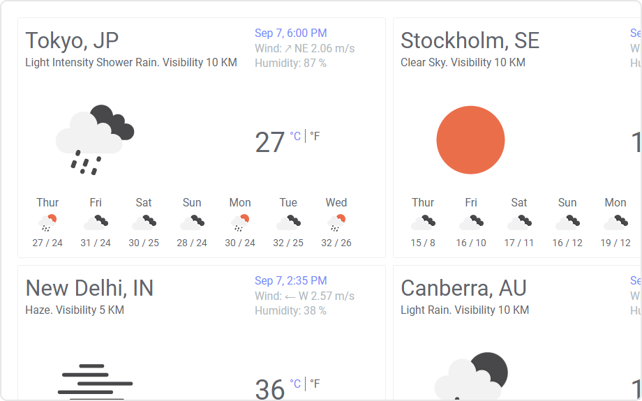

# Weather Mod for Spotfire®

Get live weather information and 7 days forecasts in Spotfire. In addition to instant weather information for a location, this visualization also provides toggleable temperature (°C or °F) in local time and current weather conditions like wind, humidity, visibility and weather description.

Can be used in a variety of analytical dashboards across numerous industry domains like aviation, agriculture, logistics, manufacturing, oil & gas, transportation etc. to provide current weather conditions.

## Installation & Use

[Download latest version](https://github.com/spotfiresoftware/spotfire-mod-weather/releases)

The [Wiki](https://github.com/spotfiresoftware/spotfire-mod-weather/wiki) contains step-by-step instruction on how to install and use this Mod in Spotfire®.

## Building the Project

In a terminal window:
- `npm install`
- `npm run server`

## About Mods for Spotfire®
-   [Spotfire Community Exchange](https://community.spotfire.com/files/): A safe and trusted place to discover ready-to-use Mods
-   [Developer documentation](https://spotfiresoftware.github.io/spotfire-mods/docs/): Introduction and tutorials for Mods developers
-   [Mods examples](https://github.com/TIBCOSoftware/spotfire-mods/): A public repository for examples projects
